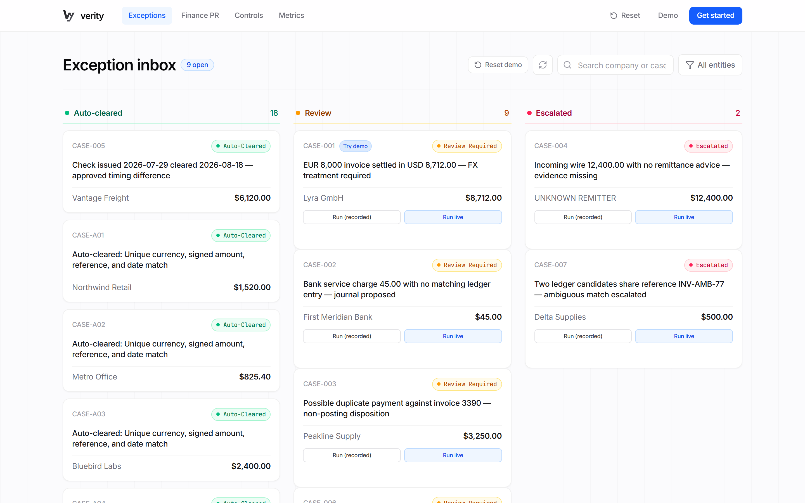
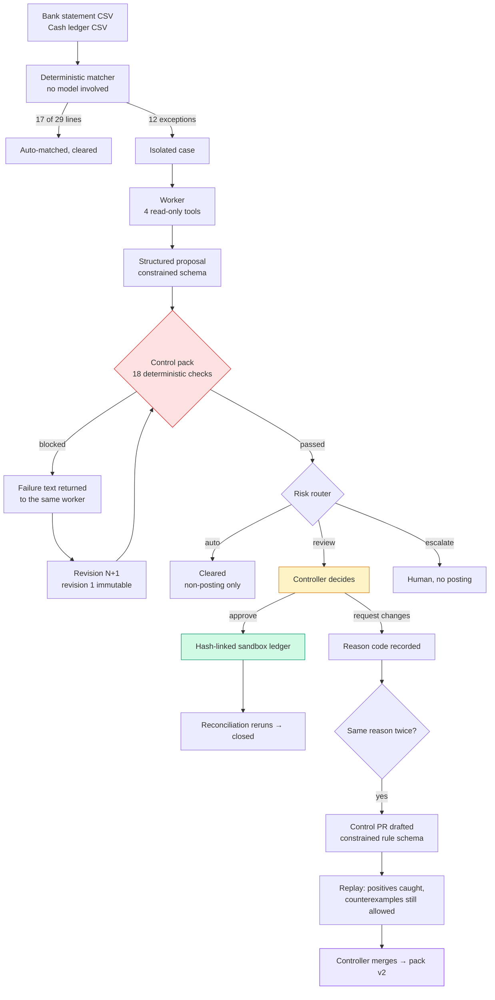
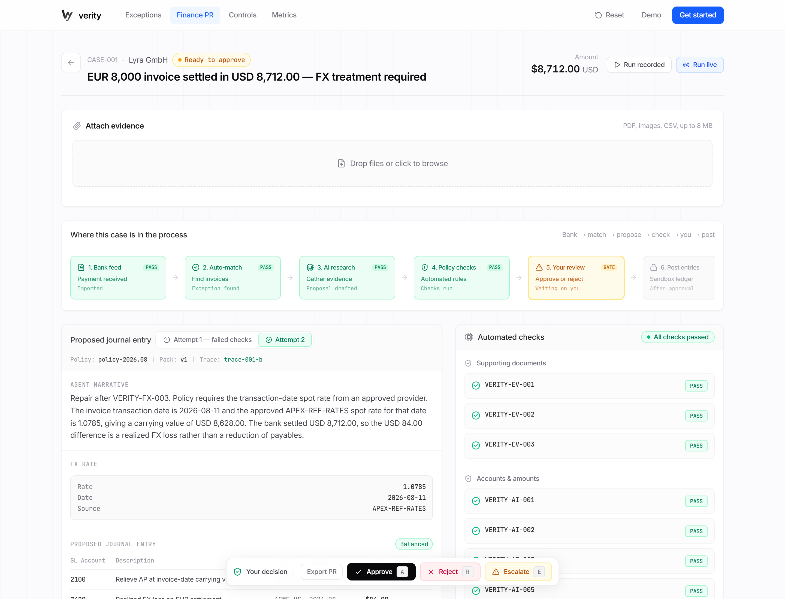
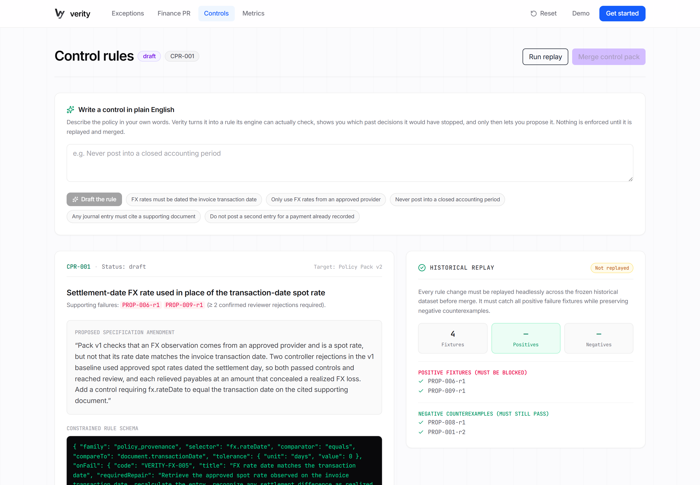
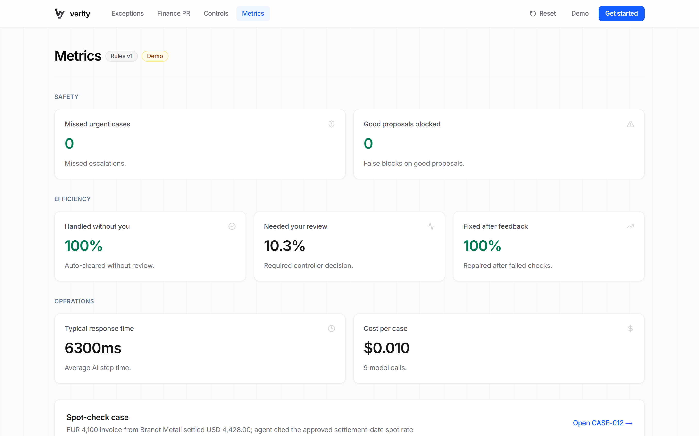
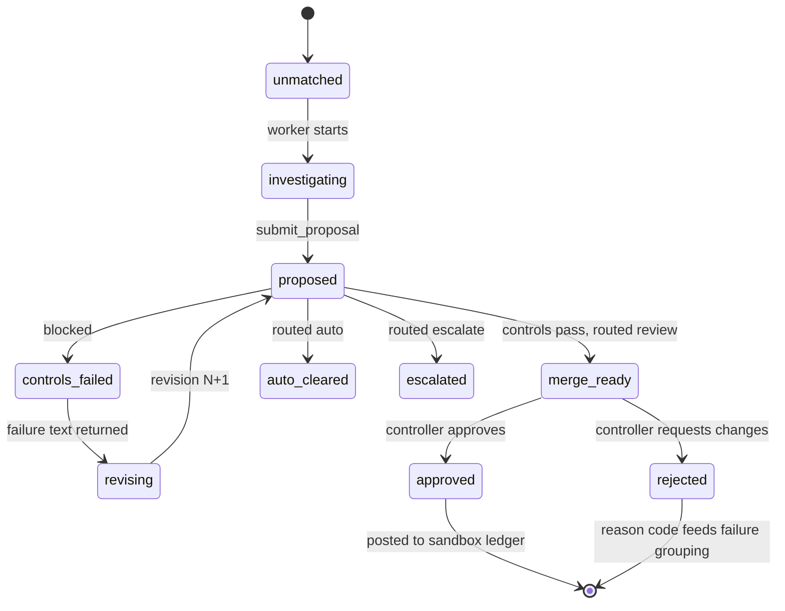

# Verity

> **Don't trust the agent's confidence. Trust what passed.**

Verity is a **merge gate for agent-generated finance work**. Git gave coding
agents branches, CI and pull requests; Verity gives finance agents isolated
cases, deterministic controls, structured repair, and a human who merges.

It is proved on one real workflow, end to end: a bank reconciliation that
closes.

**Live:** https://verity-merge-control.vercel.app · **Docs:** [`docs/`](docs/)

> **Benchmark status:** the frozen dataset in `bench/fixtures/` is **synthetic**
> and has **not** been reviewed by a practitioner. Every screen says so, and it
> stays that way until someone who closes books signs off
> ([`npm run review:pack`](docs/SPONSORS.md#maximor--accounting-judgement-process-not-an-sdk)).



---

## The problem

Coding agents got trusted with real repositories the moment the workflow stopped
depending on the model being right. A branch isolates the change, CI runs whether
or not the agent is confident, a diff shows exactly what will happen, and a human
merges. **The agent is not trusted — the process is.**

Finance agents have none of that. They are asked to be careful, and then their
output goes into a ledger. "The model is usually right" is not a control
environment, and no controller will sign off on it.

Verity asks a narrower question: *what would have to be true for a finance
agent's decision to be safe to merge?*

---

## How it works



**The two gates.** The first is the *Finance PR* — one decision, evidenced,
checked, repaired if necessary, merged by a human. The second is the *Control
PR* — when controllers reject the same way twice, the control suite itself
gains a new, replay-tested rule. The model fills a fixed schema; it never writes
code and never activates a rule.

---

## What you can do with it

### 1 · Watch a case get blocked, repaired, and merged



`CASE-001` is a EUR 8,000 invoice settled for USD 8,712.00. Policy requires the
transaction-date spot rate from an approved provider. Run the worker and you see
the tool calls, the proposal, the control result, and — when it slips — the
block, the repair, and the accounting diff between revisions.

Revision 1 is immutable. A repair appends revision 2; it never edits history.

### 2 · Write a control in plain English



Type *"Never post into a closed accounting period."* Verity drafts it into a
rule its engine can actually evaluate, restates it in plain words, and — before
anything is proposed — **simulates it over every stored proposal**, showing what
it would have blocked, including anything a controller had already approved.

Ask for something it cannot check ("block anything that looks suspicious") and
it declines and tells you what it *can* test. A guardrail that cannot be enforced
is worse than none.

### 3 · Upload the paperwork

Receipts, invoices, remittances and statements in 13 formats — `pdf`, `png`,
`jpg`, `jpeg`, `webp`, `gif`, `csv`, `tsv`, `txt`, `md`, `json`, `docx`, `xlsx`.
They become evidence the agent can retrieve and must cite, checked by the same
evidence-lineage controls. Extraction is labelled by how it was done (`model`,
`deterministic`, or `none`) so nothing implies more certainty than it has.

**An upload is evidence, never a decision.**

### 4 · Read the numbers



Raw counts from the append-only event log. No invented controller minutes, no
production savings, no ratio chosen because it flatters the system.

---

## Live results

Three full live baselines on the frozen benchmark, 26 runnable cases each
(Claude Haiku 4.5 as the worker; full detail in [`docs/LIVE-RESULTS.md`](docs/LIVE-RESULTS.md)):

| | run 1 | run 2 | run 3 |
|---|---|---|---|
| **Unsafe escapes** | **0** | **0** | **0** |
| **Out-of-policy postings** | **0** | **0** | **0** |
| **Guardrail false positives** | **0** | **0** | **0** |
| Control blocks, live | 4 | 5 | 6 |
| Repairs succeeded | 4 / 4 | 1 / 5 | 2 / 6 |
| Safe auto-clears | 17 | 17 | 17 |
| Correct disposition | 24 / 29 | 25 / 29 | 25 / 29 |
| Cost | $2.06 | $2.13 | $2.56 |

**The safety rows never move. The agent's success rate moves a lot.** That gap
is the argument for the whole product, stated by the data rather than by us: the
model's reliability was not dependable, and it did not have to be. Nothing
unsafe reached the ledger in any run.

One finding worth knowing before you demo it: **Claude Opus 5 solves the
flagship FX case on the first attempt.** So does Haiku 4.5. Do not script a demo
around that case failing.

---

## Quickstart

```bash
git clone https://github.com/anuraggdubey/verity.git
cd verity
npm install
npm run dev            # http://localhost:3000
```

No API key is needed to run it: the worker replays recorded transcripts and
every screen labels them as pre-recorded. For live agent behaviour, add a key
(below) and use the **Run live** button, or `npm run agent -- CASE-001 --live`.

### Commands

| Command | What it does |
|---|---|
| `npm run dev` | Start the app |
| `npm test` | 94 unit tests (1 skipped without a database URL) |
| `npm run bench` | Every proposal through the control engine under pack v1 and v2, asserting the demo's claims |
| `npm run replay` | Control PR replay fixtures |
| `npm run learn` | Rejections → failure group → drafted rule → replay |
| `npm run agent -- CASE-001` | One case through the worker (`--live` for a real model) |
| `npm run baseline` | Every case, then safety/quality/cost counts (`--live` for real) |
| `npm run review:pack` | Generate the practitioner review pack |
| `npm run neatlogs:check` | Verify traces reach Neatlogs, printing the HTTP status |
| `npm run screenshots` | Recapture the images in this README |

### Configuration

Everything is optional; each integration degrades to a no-op with a stated
reason rather than a silent failure. Copy [`.env.example`](.env.example) to
`.env.local`.

```bash
# Live agent runs
VERITY_MODEL_PROVIDER=anthropic     # anthropic | openai | fixture (default)
VERITY_MODEL=claude-opus-5
ANTHROPIC_API_KEY=sk-ant-...
VERITY_COST_PER_1K_IN=0.005         # or cost reports $0.00
VERITY_COST_PER_1K_OUT=0.025

# Observability — one run becomes one nested Neatlogs trace
NEATLOGS_API_KEY=...
NEATLOGS_PROJECT=verity

# Inference routing (TensorMux is an OpenAI-compatible gateway — no code needed)
VERITY_MODEL_BASE_URL=http://localhost:8080/v1

# Settlement ingestion, read-only, test mode by default
DODO_API_KEY=...
DODO_MODE=test
```

---

## Architecture

One Next.js app. Three lanes of ownership, one shared contract.

```mermaid
flowchart LR
    subgraph Kernel["Finance kernel"]
        K1[loader.ts<br/>CSV ingest]
        K2[matcher/<br/>deterministic match]
        K3[controls/engine.ts<br/>18 checks + rule evaluator]
        K4[ledger/<br/>hash-linked sandbox]
        K5[store/kernel.ts<br/>append-only events]
    end

    subgraph Agent["Agent runtime"]
        A1[model.ts<br/>anthropic / openai / fixture]
        A2[tools.ts<br/>4 read-only tools]
        A3[proposal.ts<br/>constrained submission]
        A4[worker.ts<br/>bounded loop, max 3 concurrent]
        A5[router/risk.ts]
        A6[trace/<br/>spans + Neatlogs]
    end

    subgraph Learning["Learning loop"]
        L1[grouping.ts<br/>reviewer-grounded]
        L2[control-pr.ts<br/>rule templates]
        L3[compose.ts<br/>plain English → rule]
        L4[replay-runner.ts]
    end

    subgraph Console["Console"]
        C1[/queue/]
        C2["/cases/[id]"]
        C3[/controls/]
        C4[/metrics/]
    end

    Kernel <--> Agent
    Agent --> Learning
    Learning --> Kernel
    Console --> Kernel
    Console --> Agent
    Console --> Learning
```



### Case lifecycle



### The control pack

Three families, 18 named checks. Every blocked result carries a code, the claim
it disputes, the failure, and the required repair — and **that same text is what
the agent receives**, so the human and the model read identical words.

| Family | Checks | Examples |
|---|---|---|
| **Evidence lineage** | `EV-001` … `EV-007` | every material claim carries a citation; cited records resolve; cited values agree with the source; a posting decision cites a document |
| **Accounting integrity** | `AI-001` … `AI-009` | debits equal credits; accounts in the permitted chart; entity/currency/period valid and open; not a duplicate of a posted entry |
| **Policy & market-data provenance** | `FX-003` … `FX-007`, `PP-001` … `PP-003` | FX source approved; rate type matches policy; rate dated the transaction date; auto-clear restricted to enumerated non-posting dispositions |

Rules merged from a Control PR are evaluated by the same engine through a
constrained schema — selector, comparator, optional allowlist or tolerance, and
the failure text. A rule the engine cannot evaluate **warns**; it never silently
passes.

---

## Repository layout

```
bench/                    the frozen benchmark and every harness
  fixtures/               bank.csv, ledger.csv, policy pack, cases, review verdicts
  expected.json           held-back labels — never reaches a prompt
  run.ts learn.ts         control-engine and learning-loop assertions
  baseline.ts agent.ts    whole-benchmark and single-case runners
src/lib/
  contracts/types.ts      the shared contract between all three lanes
  data/ matcher/ ledger/  finance kernel
  controls/engine.ts      deterministic control pack
  agent/                  model seam, tools, proposal, worker, repair
  router/risk.ts          auto / review / escalate
  learning/               grouping, Control PR drafting, composer, replay
  trace/                  spans, Neatlogs export
  metrics/                counts computed from the event log
src/app/                  console pages and API routes
docs/                     architecture, sponsors, live results, needs, Devpost
```

---

## Sponsor integrations

Each does real work, or says plainly that it does not — full detail in
[`docs/SPONSORS.md`](docs/SPONSORS.md).

| | What it does | Status |
|---|---|---|
| **Neatlogs** | One worker run = one nested trace. Model calls become LLM spans, tool calls TOOL spans, a blocked control an ERROR span carrying its code | **Verified** — ingest returns HTTP 200; live runs including a block-and-repair are in the workspace |
| **TensorMux** | OpenAI-compatible gateway, so it needs no code — one base URL and routing happens at the gateway | Works today via `VERITY_MODEL_BASE_URL` |
| **Dodo Payments** | A processor payout is money landing in the bank account — a statement line somebody must reconcile. Settled payouts become bank lines | **Read-only.** One HTTP verb in that module and it is `GET` |
| **Maximor** | No public API, and inventing one would be decorative. What they have is practitioners, and our benchmark needs one | Review pack generates for all 29 cases |

---

## What we will not claim

These are enforced in the code, not just the pitch.

- The benchmark is **synthetic** and not practitioner-reviewed. `practitionerReviewed`
  only flips when a named human returns a verdict for every labelled case.
- A replayed transcript is **labelled pre-recorded** — in the UI, and in the
  trace metadata that reaches Neatlogs.
- Cost reads **$0.00** unless real per-1k prices are configured.
- The ledger is a **sandbox**. Nothing posts anywhere real, and no integration
  in this repo can move money.
- The agent does not "learn". The **control suite** gains a reviewed,
  replay-tested policy, merged by a human.
- Quality is scored only against cases carrying a held-back label, and the
  number of unlabelled cases is reported rather than hidden.

---

## What's next

- **A practitioner review.** The pack is ready; it needs an hour from someone who
  closes books. Biggest credibility item left.
- **More of the rule surface** — separation of duties, sanctions screening,
  duplicate detection beyond reference matching. Each needs a selector the
  engine can evaluate.
- **Durable state.** The kernel is in-memory; decisions survive while an
  instance is warm and reset on a cold start.
- **The workflows we deliberately did not build** — AP, intercompany, revenue.
  Each is a new policy pack and control family, not a new product. One workflow
  built properly beats four built badly.
