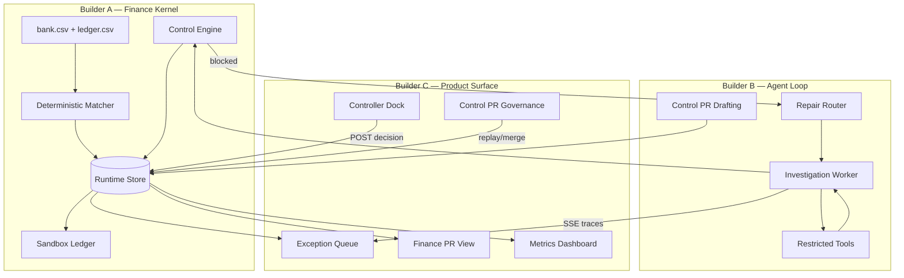

# Verity Architecture

Verity is split across three parallel builders. Each owns a directory boundary; shared contracts live in `src/lib/contracts/types.ts`.

## System Diagram



## Data Flow — Single Case

```
1. Matcher emits exception case (unmatched bank line)
2. Worker investigates → Proposal rev 1
3. Control engine evaluates → blocked (e.g. VERITY-FX-003)
4. Repair loop → Proposal rev 2 → controls pass → merge_ready
5. Controller approves → journal posted to hash-linked sandbox ledger
6. Reconciliation re-run → balances agree → closed
```

## Module Ownership

| Module | Owner | Responsibility |
|---|---|---|
| `src/lib/data/` | A | Frozen benchmark, matcher, data access |
| `src/lib/store/` | A | Append-only events, case state, ledger posting |
| `src/lib/controls/` | A | Deterministic control families, policy packs |
| `src/lib/agent/` | B | Worker, tools, repair, fixture transcripts |
| `src/lib/learning/` | B | Failure grouping, Control PR drafting, replay runner |
| `src/lib/trace/` | B | Worker trace instrumentation + SSE |
| `src/app/(queue\|cases\|controls\|metrics)/` | C | Product UI wired to APIs |
| `src/lib/metrics/` | C | Dashboard metrics from event store |
| `src/lib/contracts/` | Shared | Type contracts (frozen after M1) |

## Store as Source of Truth

Every number on the metrics screen traces to an event in `VerityEvent`:

- `model_call` → latency, tokens, cost
- `controller_decided` → controller touch rate
- `repair_requested` + next revision → repair success
- `control_pr_replayed` → auto-clear before/after regression
- `journal_posted` → sandbox ledger records

## Control Pack Versioning

- **v1** — Base policy pack (`src/lib/controls/packs/v1.json`)
- **v2** — v1 + merged Control PR rule (VERITY-FX-005: rate date must match transaction date)
- Held-out **CASE-012** demonstrates v1 pass → v2 block without being used to draft CPR-001

## API Boundary

The UI never imports from `lib/store` directly. All reads and writes go through Next.js API routes under `src/app/api/`, keeping the product layer (C) decoupled from kernel internals (A).
